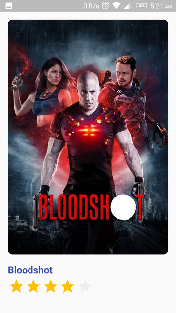

# MoviesApp-Flutter

Movies application that I made it when I try to Explore and learn Flutter

Get the data from: [www.themoviedb.org](https://www.themoviedb.org)

## Using Flutter APIs:

- [provider](https://pub.dev/packages/provider) version: 4.0.5+1 
- [rxdart](https://pub.dev/packages/rxdart) version: 0.24.0
- [http](https://pub.dev/packages/http) version: 0.12.1 
- [flutter_rating_bar](https://pub.dev/packages/flutter_rating_bar) version: 3.0.1+1

## Screenshot:

